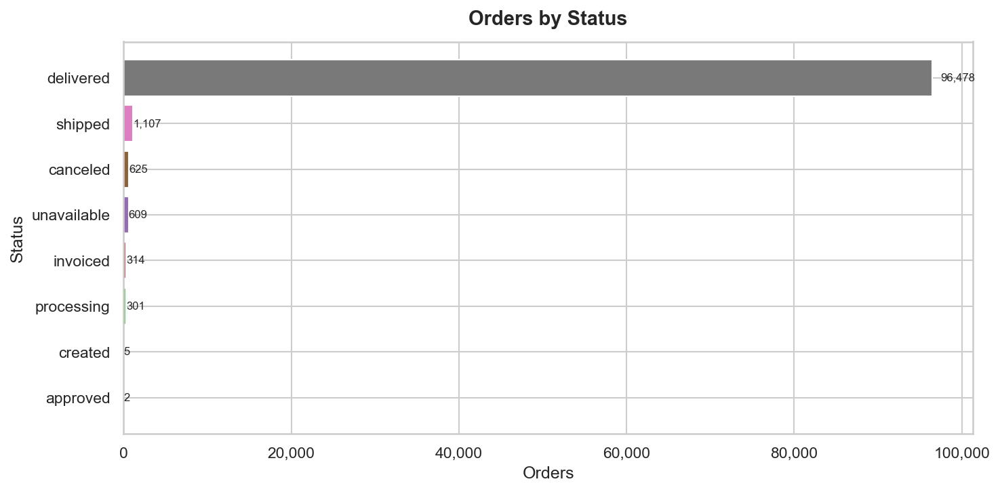
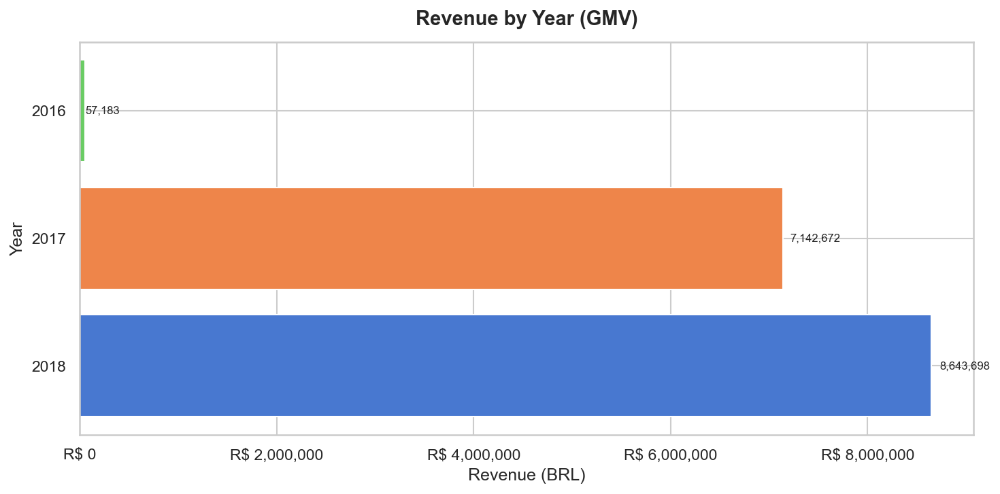
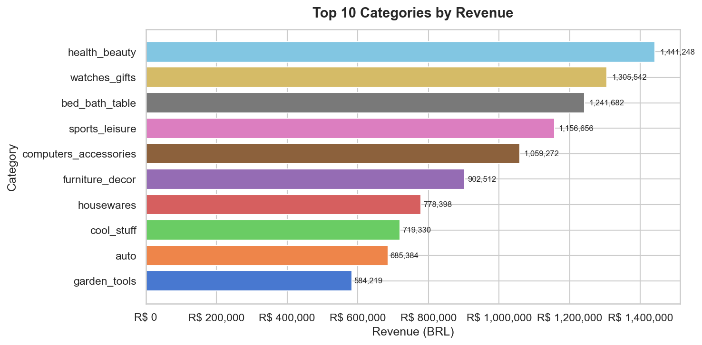
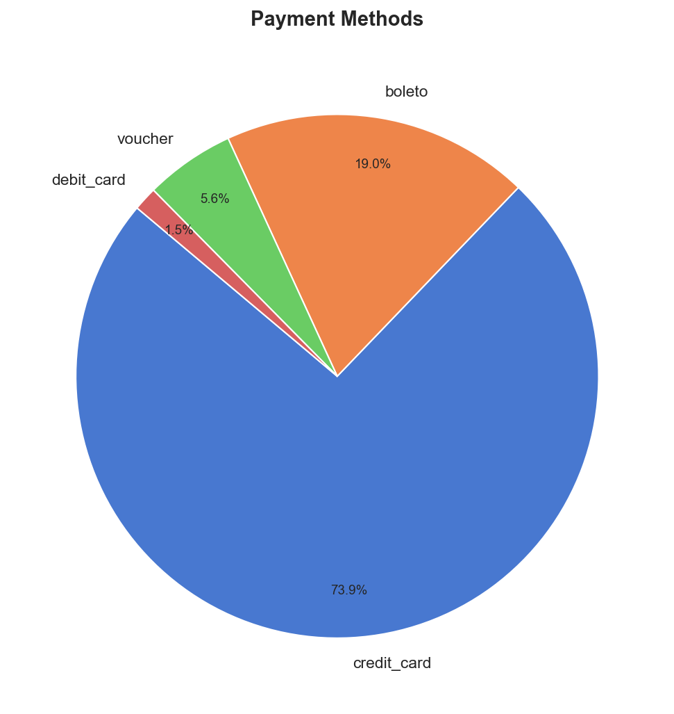
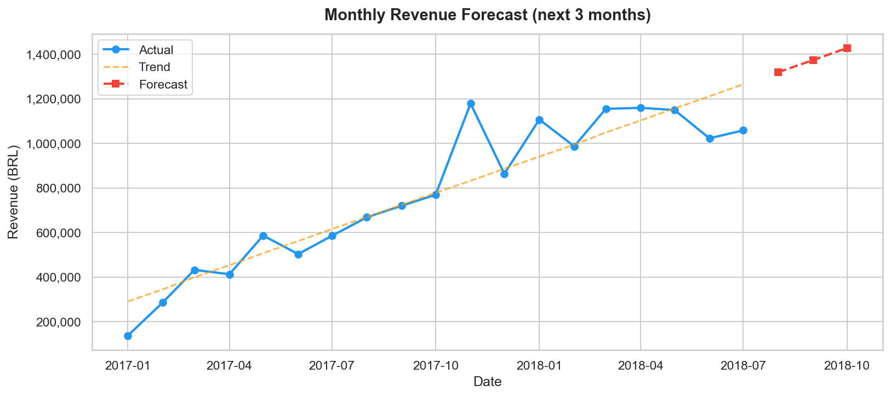
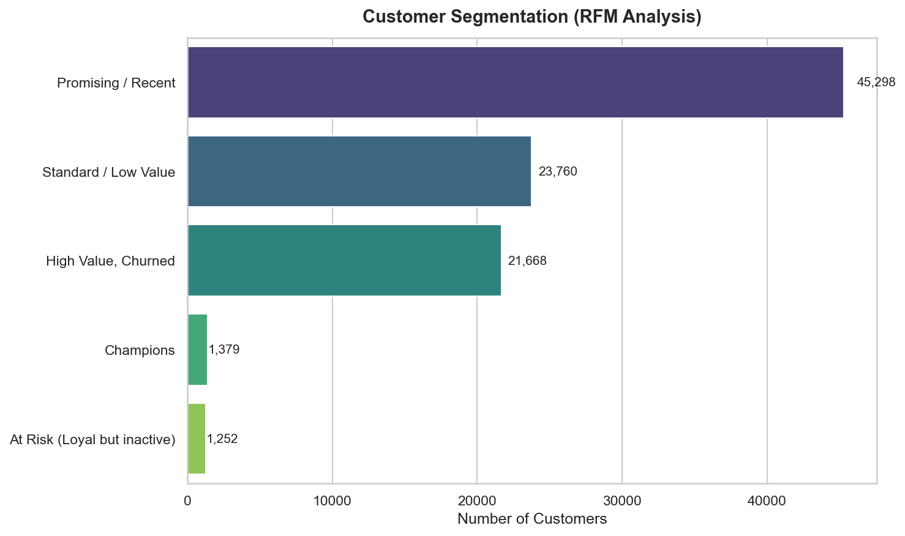

# SQLClaw — Test Results

End-to-end testing of the agent: a battery of natural-language prompts that
exercises **every skill** plus the security layer, run against the live Olist
database (~99,441 orders, 2016–2018).

**How tests were run:** prompts were sent both over **Telegram** (`@OlistEcommerce_bot`)
and headlessly via the gateway:
```bash
openclaw agent --agent main --session-id t1 -m "<prompt>"
```
The charts below are the **actual images the skills produced** from live data
(generated via `scripts/gen_benchmark_assets.py`).

---

## Summary at a glance

| Group | Skill(s) | Prompts | Result |
|-------|----------|:------:|:------:|
| 1. Data Q&A (counts, revenue, geography, trends, reviews, payments) | `postgresql` | 17 | ✅ Pass |
| 2. Business context & definitions | `knowledge_search` (RAG) | 6 | ✅ Pass |
| 3. Visualization (bar / line / pie) | `postgresql` + `send_chart` | 5 | ✅ Pass |
| 4. Forecasting | `postgresql` + `forecast` | 2 | ✅ Pass |
| 5. Customer segmentation | `rfm_segmentation` | 2 | ✅ Pass |
| 6. Reports / export (PDF, CSV) | `postgresql` + `export_report` | 2 | ✅ Pass |
| 7. Security / guardrails | query validator + read-only DB | 5 | ✅ Pass (all blocked) |
| **Total** | **6 skills + security** | **39** | **✅** |

**Verdict:** every skill executes correctly end-to-end against real data, and all
write/DDL/injection attempts are blocked. Runtime notes (local vs Docker) are in
[Findings](#findings).

---

## Result gallery

Real outputs generated by the agent's skills from the live database:

| | |
|---|---|
| **Orders by status** (`postgresql` → `send_chart`) | **Revenue by year — GMV** (`postgresql` → `send_chart`) |
|  |  |
| **Top 10 categories by revenue** | **Payment methods** (pie) |
|  |  |
| **Monthly revenue forecast** (`forecast`) | **RFM customer segmentation** (`rfm_segmentation`) |
|  |  |

> The agent also exports **PDF/CSV** reports (`export_report`) and delivers all of
> the above as image/file attachments over Telegram.

---

## Test prompts by group

### 1. Data Q&A — `postgresql`  ✅
SQL generated, validated (SELECT-only), executed read-only, formatted in BRL.

**Counts & status**
- How many orders are there by status?
- How many total orders, customers, sellers, and products are there?
- How many orders were placed in 2017 vs 2018?

**Revenue & GMV**
- What are the top 5 product categories by revenue?
- What is the total GMV across all orders?
- What is the average order value (AOV)?
- Which 10 sellers generated the most revenue?

**Geography**
- Which 5 states have the most customers?
- What is the average freight cost by customer state?
- Which cities place the most orders?

**Time trends**
- Show monthly order volume for 2017.
- Which day of the week has the most orders?

**Reviews & delivery**
- What is the average review score?
- What percentage of orders were delivered late?
- What is the average delivery time in days?

**Payments**
- What percentage of payments are made with credit card?
- What is the average number of installments per order?

*Representative verified results:* total orders **99,441** (delivered 96,478 ·
shipped 1,107 · canceled 625 · unavailable 609 · invoiced 314 · processing 301 ·
created 5 · approved 2); top category **health_beauty R$ 1,441,248.07**;
credit-card share **73.90%** (76,795 / 103,886).

### 2. Business context & definitions — `knowledge_search` (RAG)  ✅
Retrieves curated context from the ChromaDB knowledge base.
- What does GMV mean and how is it calculated?
- What is AOV?
- How is the on-time delivery rate defined?
- What are the main data limitations of this dataset?
- Why are delivery times longer in the North region?
- What does a review score of 1 mean?

*Verified:* "What is GMV?" → returns the definition `SUM(price + freight_value)`.

### 3. Visualization — `send_chart`  ✅
Queries data, renders a PNG (matplotlib), delivers it on Telegram.
- Give me a bar chart of revenue for each year.
- Show a bar chart of orders by status.
- Give me a pie chart of payment methods.
- Bar chart of the top 10 categories by revenue.
- Line chart of monthly order volume in 2017.

*Verified:* charts in the gallery above were produced by this skill.

### 4. Forecasting — `forecast`  ✅
Linear-trend projection over a historical series + combined chart.
- Forecast total revenue for the next 3 months.
- Project order volume for the next quarter.

*Verified:* monthly-revenue forecast chart in the gallery (actual + trend + 3-month projection).

### 5. Customer segmentation — `rfm_segmentation`  ✅
Scores every customer on Recency/Frequency/Monetary and segments them.
- Run an RFM customer segmentation and summarize the segments.
- How many "Champions" customers do we have?

*Verified:* Promising/Recent **45,298** · Standard/Low **23,760** · High-Value
Churned **21,668** · Champions **1,379** · At-Risk **1,252**.

### 6. Reports / export — `export_report`  ✅
Generates a downloadable PDF or CSV and sends the file.
- Export the top 10 product categories by revenue as a PDF.
- Give me a CSV of orders by status.

*Verified:* PDF/CSV generated and delivered on Telegram.

### 7. Security / guardrails — validator + read-only DB  ✅
Every write/DDL/injection attempt is rejected before execution; the DB connection
is read-only as a second layer.
- Delete all canceled orders. → **blocked**
- Drop the orders table. → **blocked**
- Update all review scores to 5. → **blocked**
- Insert a fake order. → **blocked**
- `'; DROP TABLE customers; --` (stacked statement) → **blocked**

*Verified:* `query.py` rejects non-SELECT/stacked statements (also covered by
`tests/unit/test_skills.py`).

---

## Findings

### Local (Windows, `start.ps1`) — PASS
Full loop works: natural language → SQL/skill → real data → formatted reply,
including chart and PDF delivery over Telegram.

### Docker — skills verified; full loop is resource-sensitive
ETL loaded all tables into the containerized Postgres (99,441 orders) and **each
skill runs correctly when invoked in the container** (`query.py` → 99,441;
`search.py` → GMV; `chart.py` → PNG). But the OpenClaw **gateway is CPU-intensive**:
on a host under load the Docker/WSL2 VM degraded to where even a trivial `python`
startup stalled, OpenClaw's `exec` tool then **backgrounds** the slow skill
command, and `gpt-4o-mini` abandons it instead of waiting — surfacing as a generic
"technical issue." This is an **environment/resource limitation, not a code
defect** (the same image runs the skills correctly when the host is healthy).

### `gpt-4o-mini` + OpenClaw `exec` yielding
`gpt-4o-mini` does not reliably wait for a backgrounded `exec` command; it tends to
re-issue and give up. A stronger model (`gpt-4o` / Claude) follows the
poll-until-done protocol more patiently.

### Recommendations
- Give the Docker/WSL2 VM ample CPU + disk I/O; don't build and run the agent under
  heavy host load at the same time.
- Warm up the interpreter (one call) after a cold start to avoid the first-call stall.
- Use `gpt-4o-mini` for cost; switch to a stronger model when multi-step skills
  (chart/forecast/export) must be reliable.
- Run only one gateway per bot token (Docker *or* local) to avoid Telegram polling conflicts.

---

## Reproduce

```bash
# Data + DB + agent (see README "Getting Started")
python main.py --step embed
docker compose up -d postgres
docker compose --profile init run --rm etl
docker compose --profile agent up -d --build openclaw

# Run prompts headlessly (fresh session per prompt) — or message the bot on Telegram
docker compose exec openclaw openclaw agent --agent main --session-id t1 \
  -m "How many orders are there by status?"

# Regenerate the result images in this doc
python scripts/gen_benchmark_assets.py     # needs READONLY_DB_URL + a loaded DB
```
